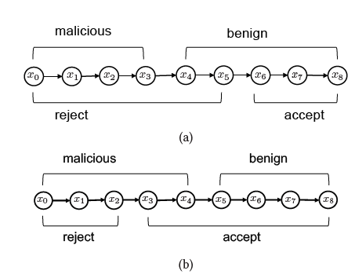




## Evading Classifiers by Morphing in the Dark
>  `Curtis Hung Dang ->National University of Singapore`
`CCS’17, October 30-November 3, 2017, Dallas, TX, USA`


-----
### 中文标题：
>  `滥用恶意软件检测器中的PDF解析器` 

-------
### Questions： 
>  
>   1)	**What is the problem?**
>       * 针对分类器逃逸，提出了一个`限制对手逃避分类器的模型—EvadeHC`
>   2)	**Why is the problem important?**
        * Learning-based systems have been shown to be vulnerable to evasion through adversarial data manipulation.
        * 通过对抗数据操作，基于学习的系统已被证明`容易逃避`
>  3)	**What is the old technique?**  
        * `机器学习`：在安全环境中有很多创新应用[19,22,28]，但是[7,11,12]表明它们可能`易于逃避`,
 许伟林在NDSS2016年的会议中的一篇文章，`自动逃逸分类`器，研究了对基于学习的系统的逃避攻击，
 可是有研究者讨论如果隐藏分类评分的`简单预防措施足以阻止这些攻击这些技术`，如何与现实中部署的真正黑匣子系统（例如内置于电子邮件服务中的恶意软件检测>器）`相互作用`仍然是一个问题，因为它们不太可能揭示实值分数，而是仅暴露其最终决策
>  4)	**What is the new technique?**
>  * we propose an `effective hill-climbing` based evasion attack `EvadeHC`
该解决方案会持续生成随机变形样本，`直至找到规避样本`。实证结果表明EvadeHC 在实验数据集上`获得100％的逃避率`，并且在执行成本方面`胜过基准解决方案高达80倍`，我们还将EvadeHC与逃避黑匣子分类器的最新技术进行比较，即使只能访问`检测器的二进制输出`，EvadeHC仍然`胜过以前的工作`

>  
>
        * Malice-flipping sample：第一个被检测器检测为良性的样本。
        * Reject-flipping sample：第一个被分类器接受的样本
        * M : 样本在测试器中的结果从恶意到良性所需经过的修改次数
        * R : 样本在检测器中的结果从拒绝到接受所需经过的修改次数
        * G = M – R

> 由此可知，`当G>0，即可得到对抗样`本。当G<0，在产生的修改后的恶意样本序列中得不到对抗样本。如上图所示：b中可得到恶意样本，a不可以
过程如下，对于一个原恶意样本：
        * （1）产生多个修改后的样本序列，得到它们的M和R值，若G>0，则停止，找到对抗样本。否则转（2）
        * （2）取（1）中G中值较大的几个malice-flipping sample的前一个样本作为原恶意样本，转入（1）。
然后基于EvadeHC方法，`使用500份恶意PDF文件在PDF(RATE)和Hidost两个恶意软件检测器上进行了实验评估`。评估结果显示，提出的绕过攻击是非常有效的，`在评估数据集上获得了100%的绕过率`，`即每一份恶意PDF文件都可以被修改成对抗样本`。
最后，对于本文中提出的攻击，作者提出了可能的缓解策略`：将对抗样本加入训练样本中增强模型。`  

>  5) **Why is the problem difficult?**
    * 有限的黑匣子访问存在两种主要的逃避挑战。首先，检测器D只提供接受/拒绝的``二进制输出``。因此，从一组恶意样本中，``不清楚哪一个更接近逃避样本``。以前的作品[34]假设D返回一个真实的置信水平，在此基础上规避逃避。尽管如此，在实践中，更`谨慎的探测器可能不会透露除最终决定之外的任何信息`。


-----
### 摘要：
>  Learning-based systems have been shown to `be vulnerable to evasion through adversarial data manipulation`. These attacks have been studied under assumptions that the adversary has certain knowledge of either the target model internals, its training dataset or at least classification scores it assigns to input samples. In this paper, we `investigate a much more constrained` and realistic attack scenario wherein the target classifier is minimally exposed to the adversary, `revealing only its final classification decision` (e.g., reject or accept an input sample). Moreover, the adversary can only manipulate malicious samples using a blackbox morpher. That is, `the adversary has to evade the targeted classifier` by morphing malicious samples `“in the dark”`. We present a scoring mechanism that `can assign a real-value score` which reflects evasion progress to each sample based on the limited information available. Leveraging on such scoring mechanism, we propose an evasion method` – EvadeHC–` and evaluate it against two `PDF malware detectors`, namely `PDFrate` and `Hidost`. The experimental evaluation demonstrates that the proposed evasion attacks are effective, `attaining 100% evasion rate on the evaluation dataset`. Interestingly, EvadeHC outperforms the known classifier evasion techniques that operate based on classification scores output by the classifiers. Although ```our evaluations are conducted on PDF malware classifiers``, the proposed approaches are `domain-agnostic` and are of wider application to other `learning-based systems`.
>
> 通过`对抗数据操作`，基于学习的系统已被`证明容易逃避`。这些攻击的研究是基于以下假设：对手对目标模型内部结构，`训练数据集或至少分配给输入样本的分类评分有一定的了解`。在本文中，我们研究了一个`更加严格`和逼真的攻击场景，其中``目标分类器最低限度地暴露给敌``手，只显示其最终分类决策（例如拒绝或接受输入样本）。而且，攻击者只能`使用黑箱变形器来操纵恶意样本`。也就是说，敌人必须通过在“黑暗中”对恶意样本进行变形来逃避目标分类器。我们```提供了一个评分机制```，可以根据可用的有限信息为每个样本指定一个真实值评分，该评分反映了每个样本的逃避进度。利用这种评分机制，我们提出了一种逃避方法 - `EvadeHC`并针对`两种PDF恶意软件检测器`（即`PDFRate`和`Hidost`）进行评估。实验评估表明，所提议的规避行为是有效的，`对评估数据集的规避率为100％`。有趣的是，`EvadeHC优于已知的基于分类器输出的分类评分运行的分类器规避技术`。尽管我们的评估是针对PDF恶意软件分类器进行的，但所提出的方法是`domain-agnostic`，并且更广泛地应用于其他基于学习的系统。


   
----
###  亮点解读和贡献： 
> *  (1) We give a formulation of classifier evasion in the dark whereby the adversary only has blackbox accesses to the detector, a morpher and a tester.We also give a probabilisitic model HsrMopher to formalise the notion that almost no domain-specific knowledge can be exploited in the evasion process.
`我们给出了一个在黑暗中逃避分类器的方法，即攻击者只能通过黑盒访问探测器，变形器和测试器。我们还给出了一个概率模型HsrMopher来形式化几乎没有领域特定知识的概念在逃避过程中被利用。`
> * (2) We design a scoring function that can assign real-value score reflecting evasion progress to samples, given only binary outcomes obtained from the detector and tester. We believe that this scoring mechanism is useful in extending existing works that necessitate classification scores or other auxiliary information to operate under a more restricted and realistic setting like the one we study.
`我们设计了一个评分函数，只给出从检测器和测试器获得的二元结果，可以给样本指定反映逃避进度的实值评分。我们认为这种评分机制对于扩展现有的需要分类评分或其他辅助信息的作品是有用的，可以在我们所研究的那种更加严格和现实的环境下进行操作。`

> * (3) Leveraging on the scoring function, we propose an effective hill-climbing based evasion attack EvadeHC. This algorithm is generic in a sense that it does not require any knowledge about the target system, even its confidence level in the classification decision.    
`利用评分函数，提出一种有效的hill-climbing逃避攻击EvadeHC。这种算法是通用的，它不需要关于目标系统的任何知识，甚至不需要关于分类决策的可信度。`

> * (4) We conduct experimental evaluation on two popular PDF malware classifiers. The empirical results demonstrate not only the efficiency but also the robustness of EvadeHC. More notably, it is also suggested that the scoring mechanism underlying EvadeHC is more informative than the one that relies solely on classification scores [34].
`对两种流行的PDF恶意软件分类器进行实验评估。实证结果不仅证明了EvadeHC的效率，而且还证明了其稳健性。更值得注意的是，也有人认为EvadeHC的评分机制比单纯依赖分类评分的评分机制更具信息量[34]`。


----
### 论文总结： 
> 
* We have proposed `a restricted adversary model` for `classifier evasion with only blackbox accesses`. Such restricted setting allows us to investigate generic evasion attacks that utilise limited information on the domain knowledge and the classifier’s specifics (e.g. model internals, and training dataset). On the one hand, this model provides the defender with a baseline of the adversary’s capability. On the other hand, the adversary could attain more effective evasion attacks by incorporating domain knowledge into the generic attacks.
* We have described EvadeHC, a generic hill-climbing based approach for evading binary-outcome detector. Our technique assumes minimal knowledge about both the detector and the data manipulation mechanism. The effectiveness of the proposed approach has been demonstrated by experimental studies conducted against two PDF malware classifiers. While the experiments are performed on malware classifiers, the proposed technique and its security implications may also be of wider application to other learning-based systems.
我们提出了一个`抗逃逸分类器的模型`，只有黑匣子访问。这种限制性设置允许我们调查利用有限领域知识和分类器特定信息（例如模型内部结构和训练数据集）的有限信息的通用躲避攻击。一方面，这种模式为后卫提供了对手能力的基准。另一方面，攻击者可以通过将领域知识纳入泛型攻击来获得更有效的躲避攻击。
我们已经描述了EvadeHC，这是一种逃避二进制结果检测器的通用爬山方法。我们的技术假定对检测器和数据处理机制都知之甚少。针对两种PDF恶意软件分类器进行的实验研究已证明了所提出方法的有效性。虽然实验是在恶意软件分类器上执行的，但所提出的技术及其安全性影响可能也会更广泛地应用于其他基于学习的系统。

