# TGIF

## Moment 

>TGIF（Thank God it's Friday）是前沿组每周五下午5点开始的1小时分享会，本着"**每周一小时，一点点感悟，一点点进步**" 的主旨，会议由前沿小组的每个成员轮流自定义内容形式并主持分享。会议过程一般比较轻松，并常伴有零食。希望TGIF能一直坚持进行下去，**在快乐中学习，在学习中进步，感谢有你**。

--------

### 历周TGIF精彩时刻   

*****
cake
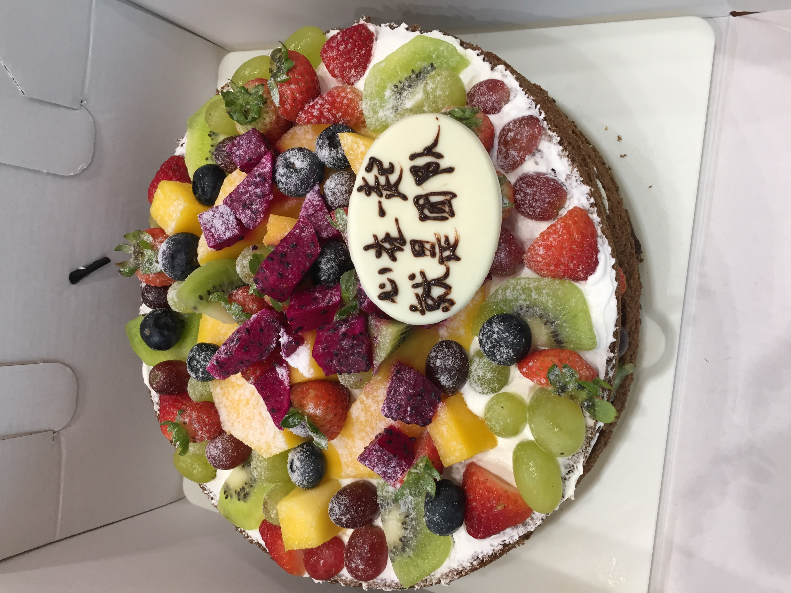
御发最后一次TGIF
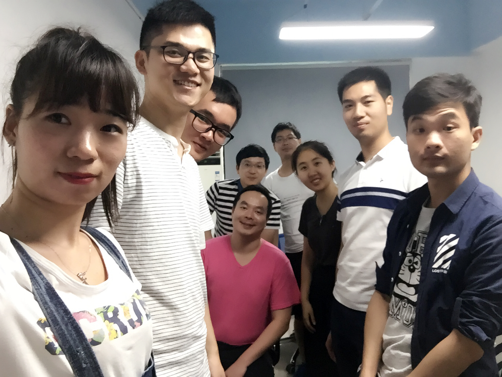
蓝盾基地217
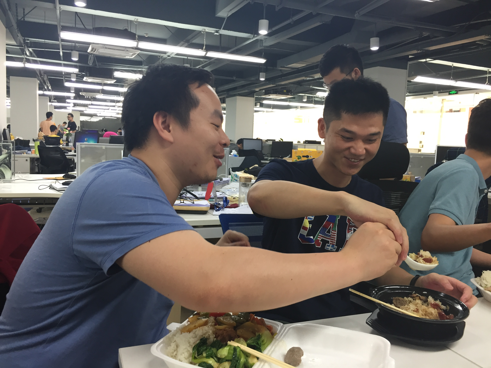
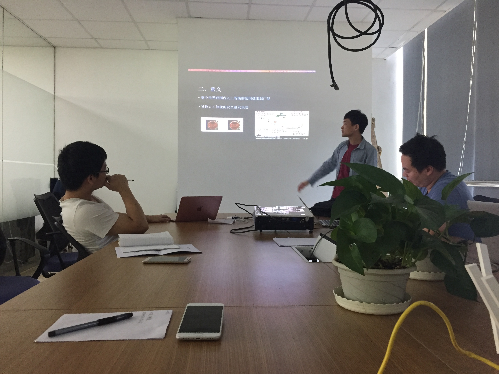
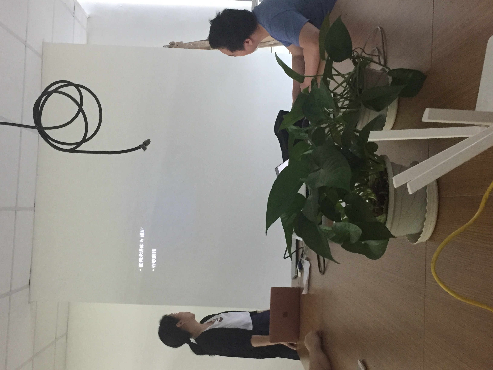
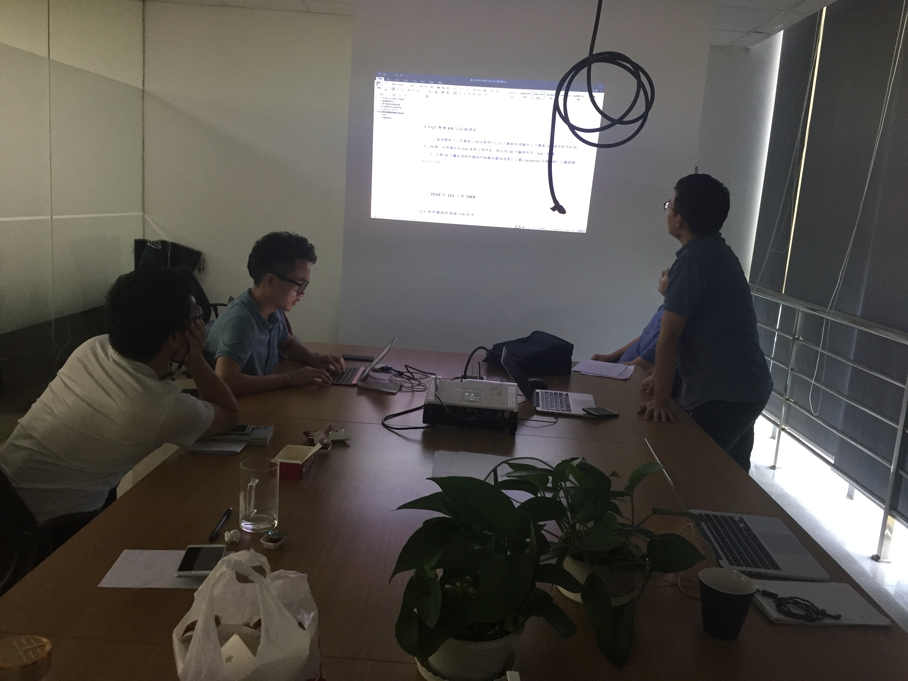
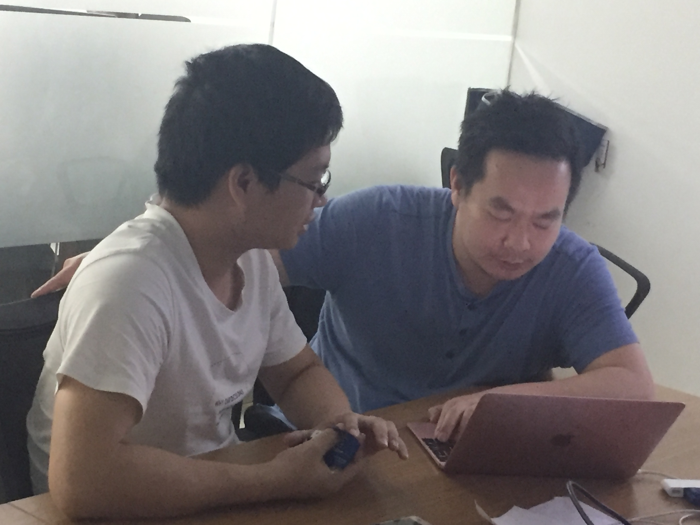
蓝盾基地105
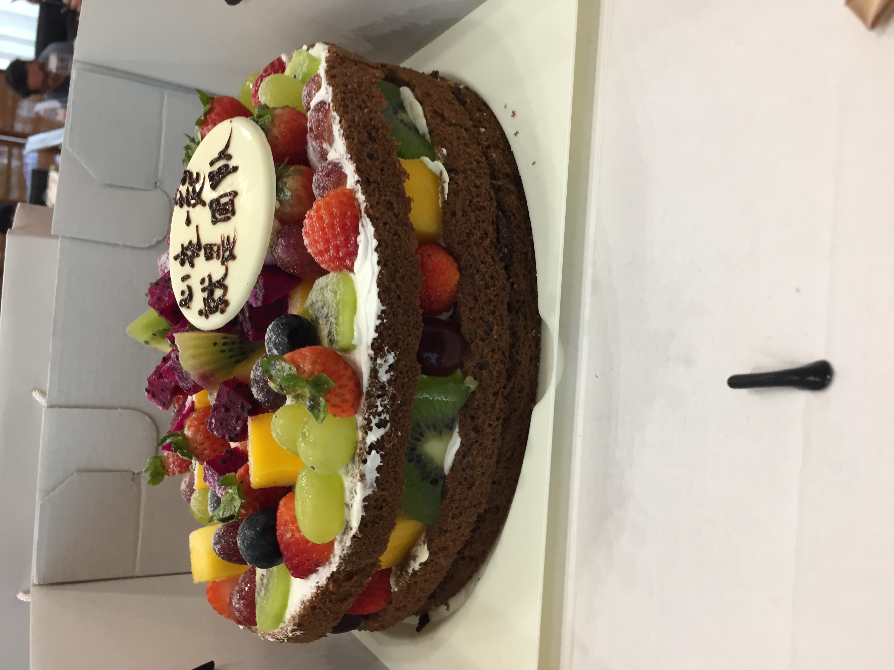
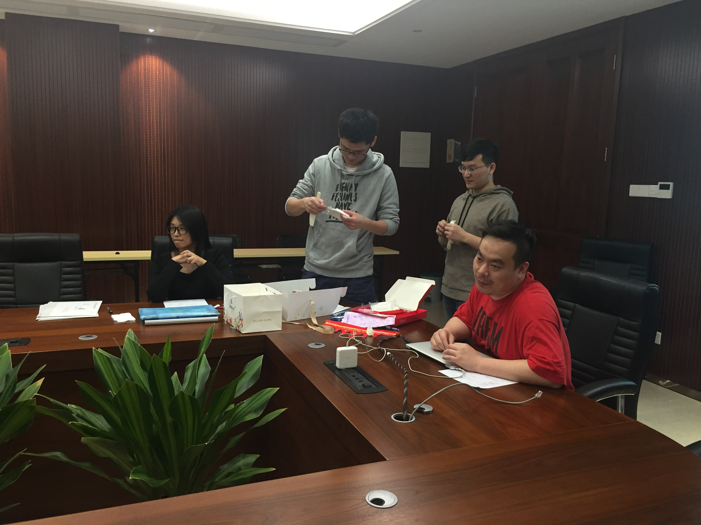
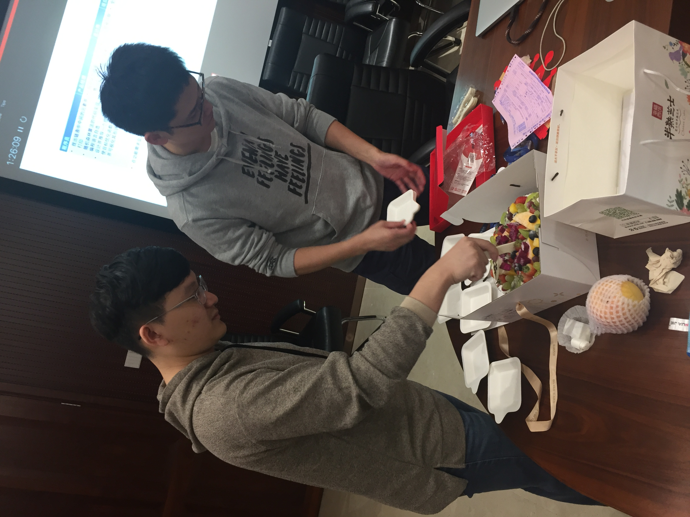

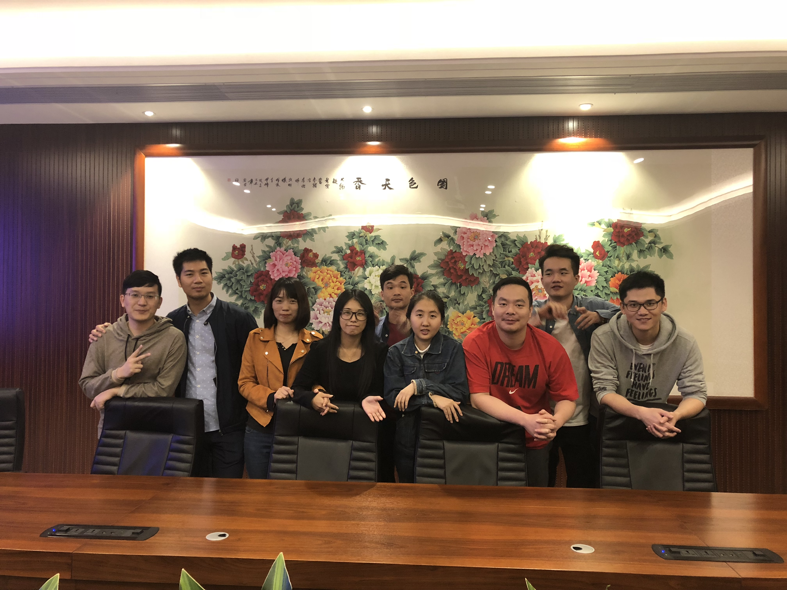

最后一次蓝盾基地TGIF
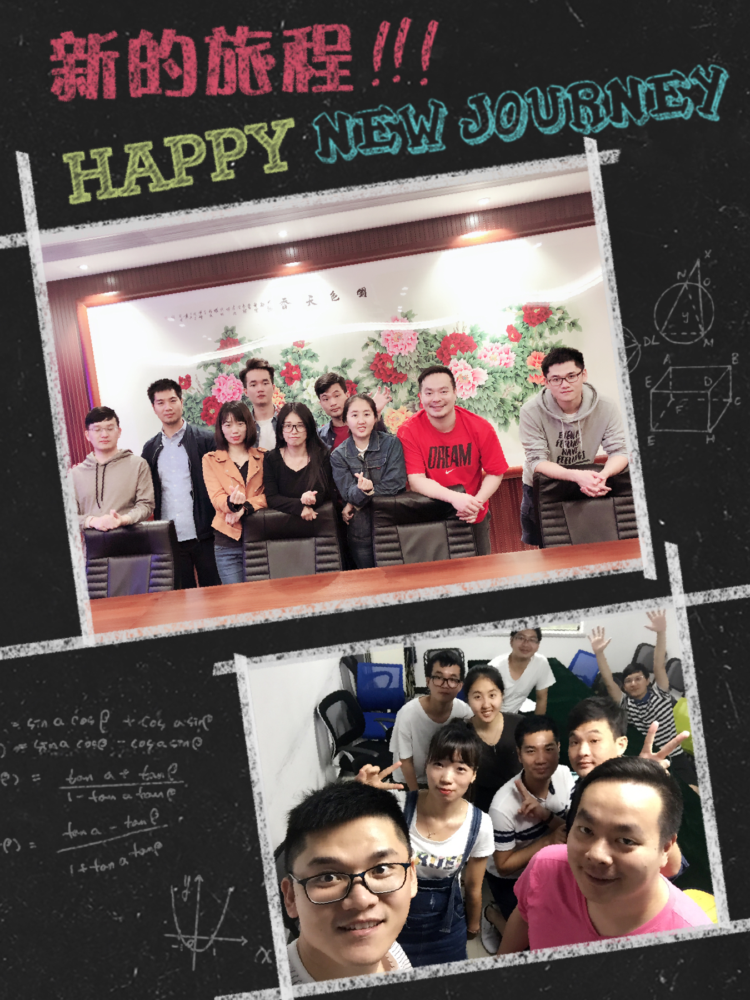

白板编程笔记集
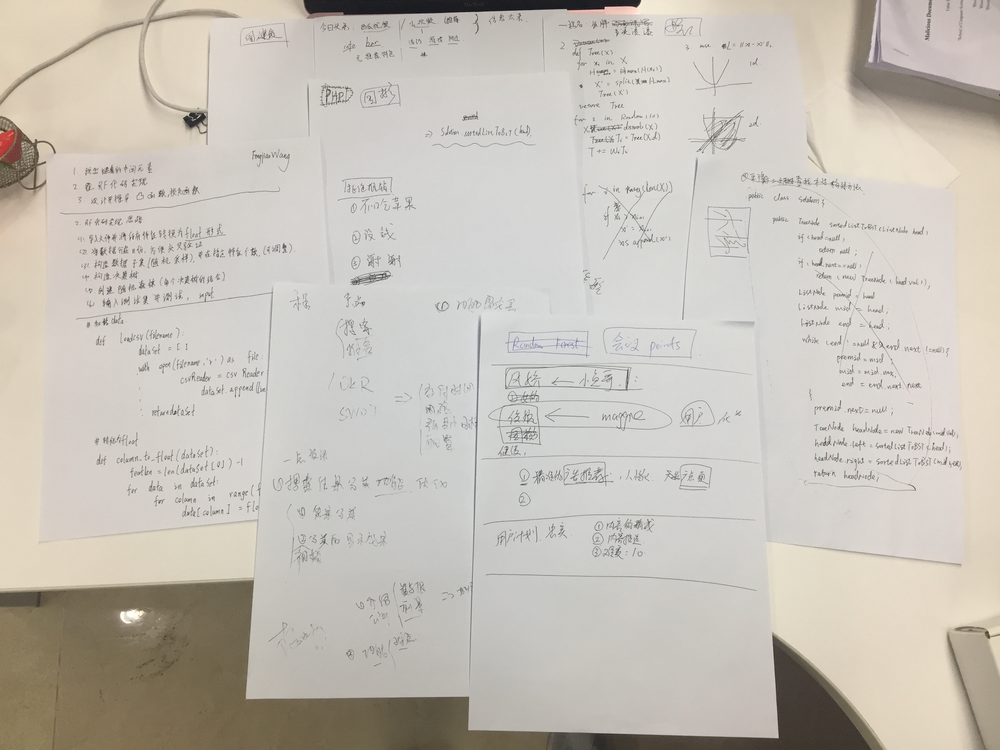
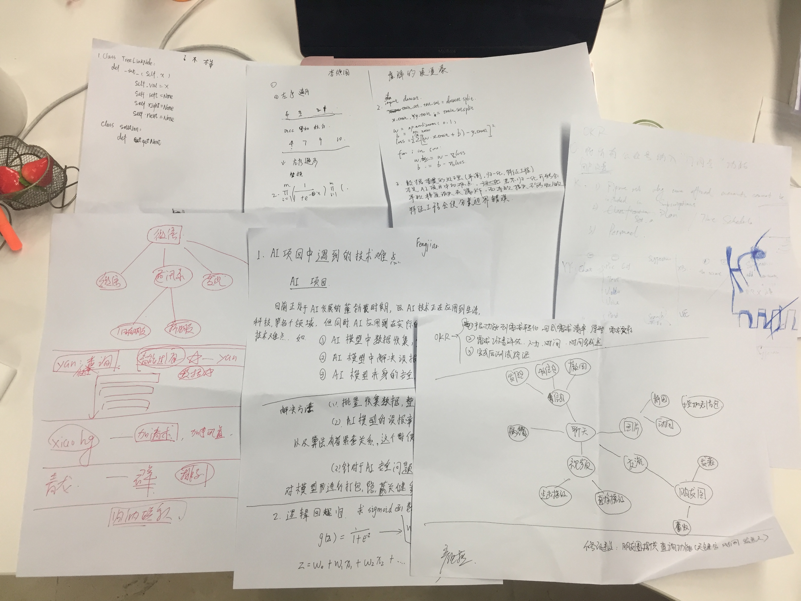

